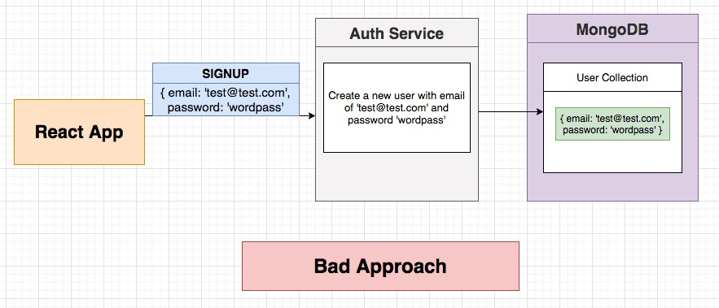
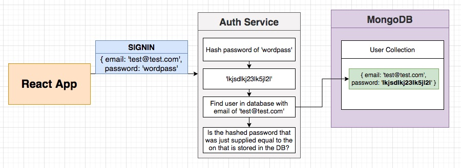

## **Section 08: Database Management and Modeling**

## Table of Contents
- [**Section 08: Database Management and Modeling**](#section-08-database-management-and-modeling)
- [Table of Contents](#table-of-contents)
  - [Creating Databases in Kubernetes](#creating-databases-in-kubernetes)
  - [Connecting to MongoDB](#connecting-to-mongodb)
  - [Understanding the Signup Flow](#understanding-the-signup-flow)
  - [Getting TypeScript and Mongoose to Cooperate](#getting-typescript-and-mongoose-to-cooperate)
  - [Creating the User Model](#creating-the-user-model)
  - [Type Checking User Properties](#type-checking-user-properties)
  - [Adding Static Properties to a Model](#adding-static-properties-to-a-model)
  - [Defining Extra Document Properties](#defining-extra-document-properties)
  - [What's That Angle Bracket For?](#whats-that-angle-bracket-for)
  - [User Creation](#user-creation)
  - [Proper Error Handling](#proper-error-handling)
  - [Reminder on Password Hashing](#reminder-on-password-hashing)
  - [Adding Password Hashing](#adding-password-hashing)
  - [Comparing Hashed Password](#comparing-hashed-password)
  - [Mongoose Pre-Save Hooks](#mongoose-pre-save-hooks)

### Creating Databases in Kubernetes


```yaml
apiVersion: apps/v1
kind: Deployment
metadata:
  name: auth-mongo-depl
spec:
  replicas: 1
  selector:
    matchLabels:
      app: auth-mongo
  template:
    metadata:
      labels:
        app: auth-mongo
    spec:
      containers:
        - name: auth-mongo
          image: mongo
---
apiVersion: v1
kind: Service
metadata:
  name: auth-mongo-srv
spec:
  selector:
    app: auth-mongo
  ports:
    - name: db
      protocol: TCP
      port: 27017
      targetPort: 27017
```

```console
cd section-08/ticketing/infra/k8s/
skaffold dev
kubectl get pods
```

**[⬆ back to top](#table-of-contents)**

### Connecting to MongoDB

```typescript
import express from 'express';
import 'express-async-errors';
import { json } from 'body-parser';
import mongoose from 'mongoose';

import { currentUserRouter } from './routes/current-user';
import { signinRouter } from './routes/signin';
import { signoutRouter } from './routes/signout';
import { signupRouter } from './routes/signup';
import { errorHandler } from './middleware/error-handler';
import { NotFoundError } from './errors/not-found-error';

const app = express();
app.use(json());

app.use(currentUserRouter);
app.use(signinRouter);
app.use(signoutRouter);
app.use(signupRouter);

app.all('*', async (req, res) => {
  throw new NotFoundError();
});

app.use(errorHandler);

const start = async () => {
  try {
    await mongoose.connect('mongodb://auth-mongo-srv:27017/auth', {
      useNewUrlParser: true,
      useUnifiedTopology: true,
      useCreateIndex: true
    });
    console.log('Connected to MongoDb');
  } catch (err) {
    console.log(err);
  }

  app.listen(3000, () => {
    console.log('Listening on port 3000!');
  });
};

start();
```

**[⬆ back to top](#table-of-contents)**

### Understanding the Signup Flow


**[⬆ back to top](#table-of-contents)**

### Getting TypeScript and Mongoose to Cooperate


Issue #1 with TS + Mongoose

Creating a new User Document
```typescript
new User({ email: 'test@test.com', password: 'lk325kj2' })
// Typescript wants to make sure we are providing the correct properties - Mongoose does not make this easy!
```

Issue #2 with TS + Mongoose

```typescript
const user = new User({ email: 'test@test.com', password: 'lk325kj2' })
console.log(user); // { email: '..', password: '..', createdAt: '..', updatedAt: '..' }
// The properties that we pass to the User constructor don't necessarily match up with the properties available on a user
```

**[⬆ back to top](#table-of-contents)**

### Creating the User Model

```typescript
// user.ts
import mongoose from 'mongoose';

const userSchema = new mongoose.Schema({
  email: {
    type: String,
    required: true
  },
  password: {
    type: String,
    required: true
  }
});

const User = mongoose.model('User', userSchema);

export { User };
```

**[⬆ back to top](#table-of-contents)**

### Type Checking User Properties

Solution for Issue #1 with TS + Mongoose

```typescript
// user.ts
import mongoose from 'mongoose';

// An interface that describes the properties
// that are requried to create a new User
interface UserAttrs {
  email: string;
  password: string;
}

const userSchema = new mongoose.Schema({
  email: {
    type: String,
    required: true
  },
  password: {
    type: String,
    required: true
  }
});

const User = mongoose.model('User', userSchema);

const buildUser = (attrs: UserAttrs) => {
  return new User(attrs);
};

export { User, buildUser };
```

**[⬆ back to top](#table-of-contents)**

### Adding Static Properties to a Model

```typescript
// user.ts
import mongoose from 'mongoose';

// An interface that describes the properties
// that are requried to create a new User
interface UserAttrs {
  email: string;
  password: string;
}

// An interface that describes the properties
// that a User Model has
interface UserModel extends mongoose.Model<any> {
  build(attrs: UserAttrs): any;
}

const userSchema = new mongoose.Schema({
  email: {
    type: String,
    required: true
  },
  password: {
    type: String,
    required: true
  }
});
userSchema.statics.build = (attrs: UserAttrs) => {
  return new User(attrs);
};

const User = mongoose.model<any, UserModel>('User', userSchema);

export { User };
```

**[⬆ back to top](#table-of-contents)**

### Defining Extra Document Properties

Solution for Issue #2 with TS + Mongoose

```typescript
import mongoose from 'mongoose';

// An interface that describes the properties
// that are requried to create a new User
interface UserAttrs {
  email: string;
  password: string;
}

// An interface that describes the properties
// that a User Model has
interface UserModel extends mongoose.Model<UserDoc> {
  build(attrs: UserAttrs): UserDoc;
}

// An interface that describes the properties
// that a User Document has
interface UserDoc extends mongoose.Document {
  email: string;
  password: string;
}

const userSchema = new mongoose.Schema({
  email: {
    type: String,
    required: true
  },
  password: {
    type: String,
    required: true
  }
});
userSchema.statics.build = (attrs: UserAttrs) => {
  return new User(attrs);
};

const User = mongoose.model<UserDoc, UserModel>('User', userSchema);

export { User };
```

**[⬆ back to top](#table-of-contents)**

### What's That Angle Bracket For?

```typescript
// index.d.ts
export function model<T extends Document, U extends Model<T>>(
  name: string,
  schema?: Schema,
  collection?: string,
  skipInit?: boolean
): U;
```

**[⬆ back to top](#table-of-contents)**

### User Creation

```typescript
// signup.ts
import express, { Request, Response } from 'express';
import { body, validationResult } from 'express-validator';
import { User } from '../models/user';
import { RequestValidationError } from '../errors/request-validation-error';

const router = express.Router();

router.post(
  '/api/users/signup',
  [
    body('email')
      .isEmail()
      .withMessage('Email must be valid'),
    body('password')
      .trim()
      .isLength({ min: 4, max: 20 })
      .withMessage('Password must be between 4 and 20 characters')
  ],
  async (req: Request, res: Response) => {
    const errors = validationResult(req);

    if (!errors.isEmpty()) {
      throw new RequestValidationError(errors.array());
    }

    const { email, password } = req.body;

    const existingUser = await User.findOne({ email });

    if (existingUser) {
      console.log('Email in use');
      return res.send({});
    }

    const user = User.build({ email, password });
    await user.save();

    res.status(201).send(user);
  }
);

export { router as signupRouter };
```

**[⬆ back to top](#table-of-contents)**

### Proper Error Handling

```typescript
// bad-request-error.ts
import { CustomError } from './custom-error';

export class BadRequestError extends CustomError {
  statusCode = 400;

  constructor(public message: string) {
    super(message);

    Object.setPrototypeOf(this, BadRequestError.prototype);
  }

  serializeErrors() {
    return [{ message: this.message }];
  }
}
```

```typescript
// signup.ts
if (existingUser) {
  throw new BadRequestError('Email in use');
}
```

**[⬆ back to top](#table-of-contents)**

### Reminder on Password Hashing





**[⬆ back to top](#table-of-contents)**

### Adding Password Hashing

```typescript
// password.ts
import { scrypt, randomBytes } from 'crypto';
import { promisify } from 'util';

// convert callback scrypt function to async await use
const scryptAsync = promisify(scrypt);

export class Password {
  static async toHash(password: string) {
    const salt = randomBytes(8).toString('hex');
    const buf = (await scryptAsync(password, salt, 64)) as Buffer;

    return `${buf.toString('hex')}.${salt}`;
  }
}
```

**[⬆ back to top](#table-of-contents)**

### Comparing Hashed Password

```typescript
// password.ts
import { scrypt, randomBytes } from 'crypto';
import { promisify } from 'util';

// convert callback scrypt function to async await use
const scryptAsync = promisify(scrypt);

export class Password {
  static async compare(storedPassword: string, suppliedPassword: string) {
    const [hashedPassword, salt] = storedPassword.split('.');
    const buf = (await scryptAsync(suppliedPassword, salt, 64)) as Buffer;

    return buf.toString('hex') === hashedPassword;
  }
}
```

**[⬆ back to top](#table-of-contents)**

### Mongoose Pre-Save Hooks

```typescript
// user.ts
userSchema.pre('save', async function(done) {
  if (this.isModified('password')) {
    const hashed = await Password.toHash(this.get('password'));
    this.set('password', hashed);
  }
  done(); // complete async work
});
```

**[⬆ back to top](#table-of-contents)**