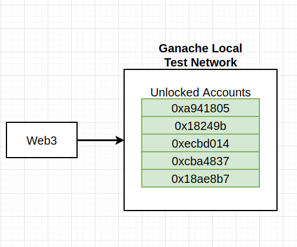

### `contract`

### `c-acct`

### `contracts`

### `c-on-comp`

### `contract-2`

### `solidity`

### `solidity-2`

### `abi`

### `structure`

### `functions`

### `specifiers`

### `inbox`

### `inbox-2`

### `contract-creation`

### `reading`

### `creation`

### `change`

### `diff`

### `calls`

### `wei`

### `wei-2`

### `gas`

### `g-examples`

### `gas-2`

### `project`

### `deployment`

### `deployment-options`

### `node`

### `scratch`

### `goals`

### `folders`

### `testing`

### `providers`

### `web3`

### `mocha`

### `operations`

### `ops`

### `ganache`

### `web3-2`

### `contracts-4`

### `deployment-2`

### `multiple-account`

### `keys`

### `mnemonic`

### `mnemonic-2`

### `hosting provider`

