### `lottery`

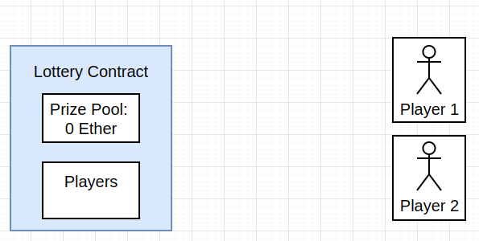

### `enter`

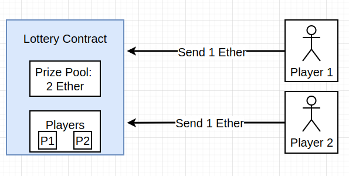

### `pick`

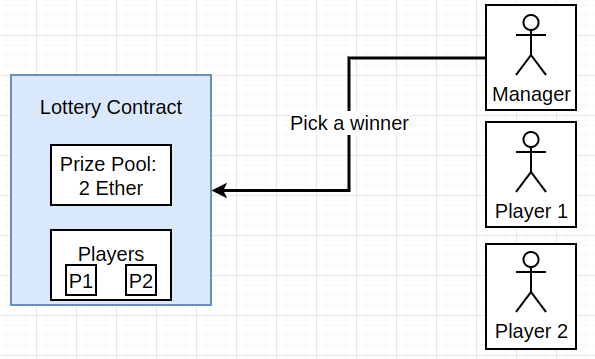

### `pick-2`

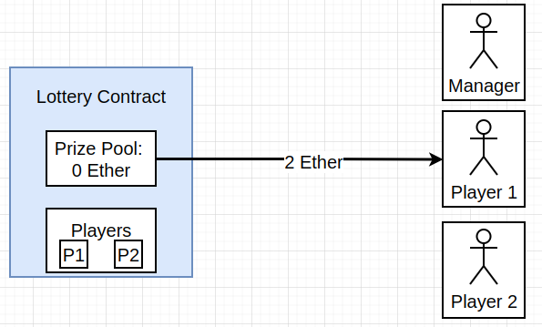

### `reqs`

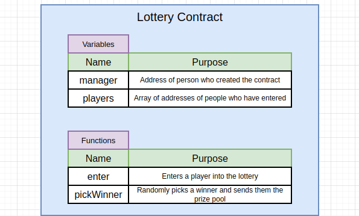

### `types`

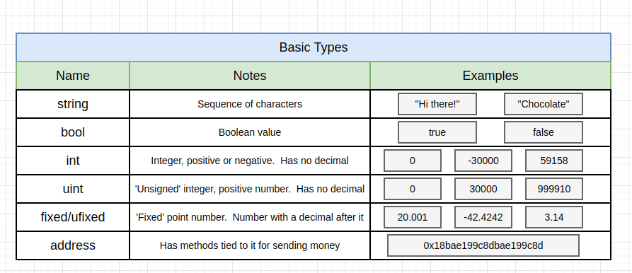

### `ints`

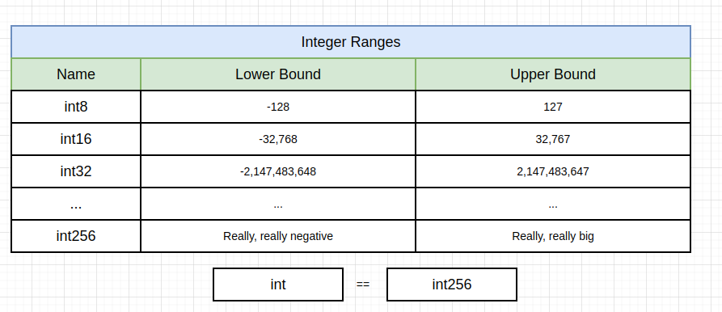

### `unit`

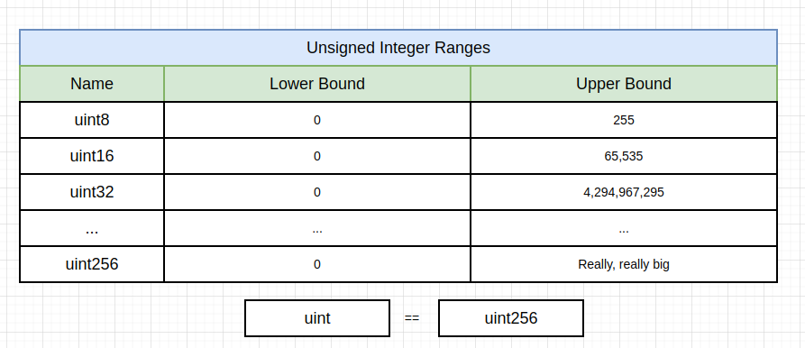

### `msg`

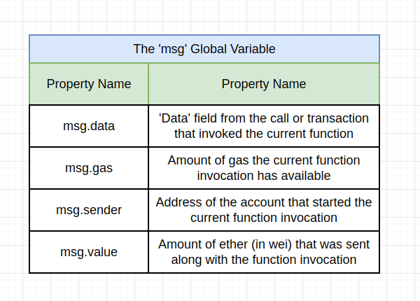

### `msg-2`

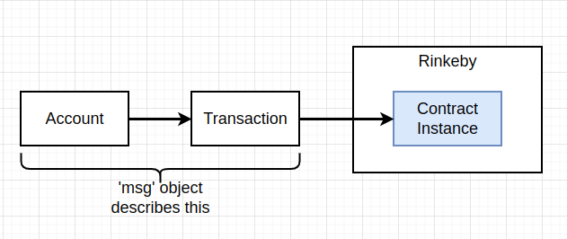

### `msg-call`

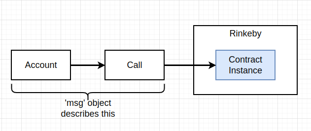

### `advanced-types`

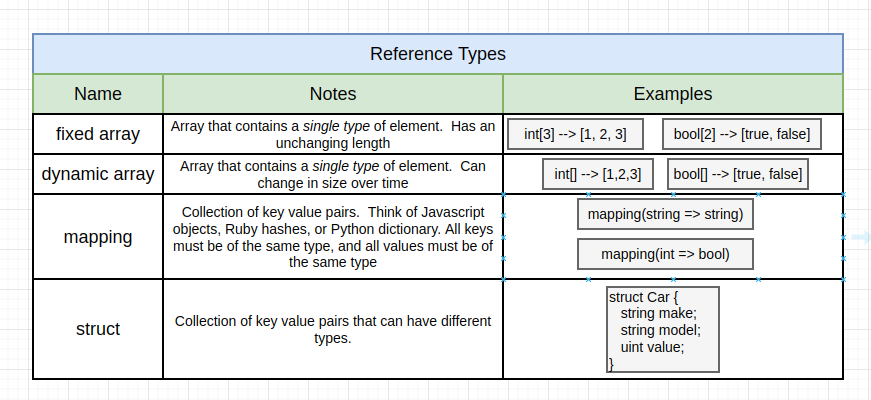

### `array-gotchas`

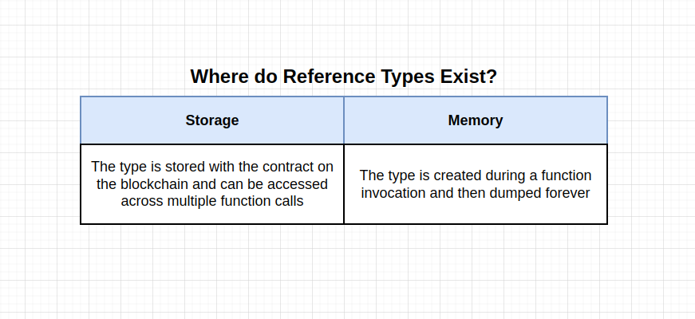

### `context`

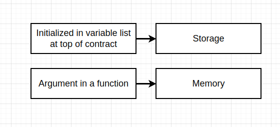

### `string`

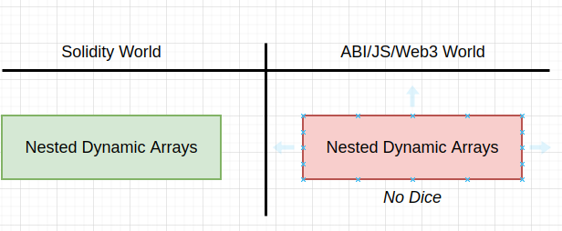

### `no-random`

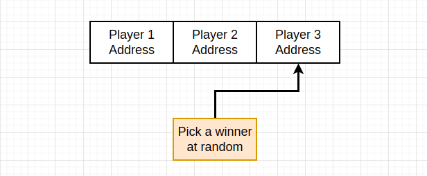

### `random-numbers`

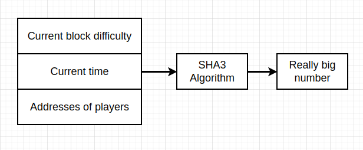

### `modulo-operator`

### `issues`

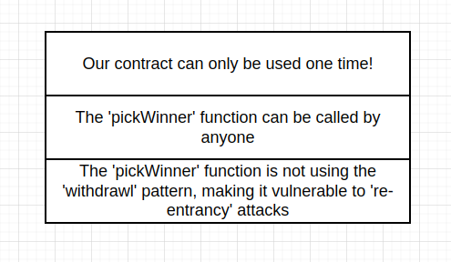

### `rentrance`

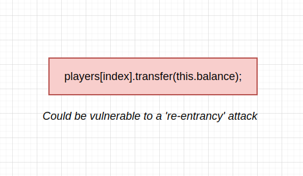

### `withdrawl`

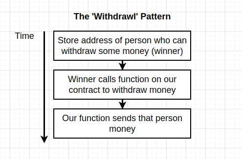

### `withdrawl-pattern`

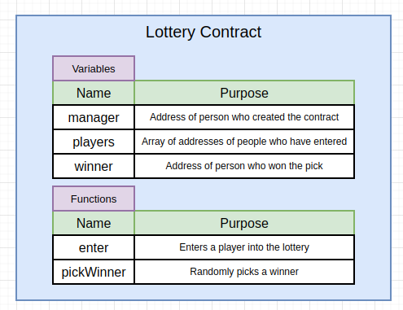

### `reset`

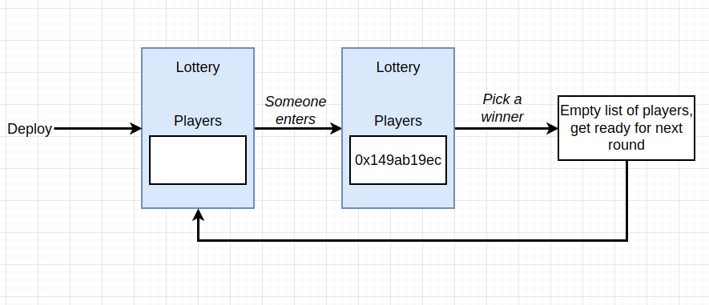
