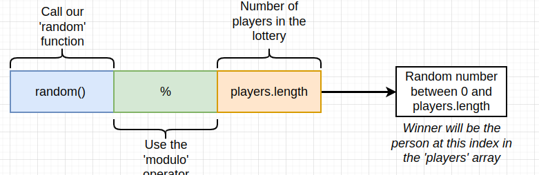

### `lottery`

### `enter`

### `pick`

### `pick-2`

### `reqs`

### `types`

### `ints`

### `unit`

### `msg`

### `msg-2`

### `msg-call`

### `advanced-types`

### `array-gotchas`

### `context`

### `string`

### `no-random`

### `random-numbers`

### `modulo-operator`

### `issues`

### `rentrance`

### `withdrawl`

### `withdrawl-pattern`

### `reset`

