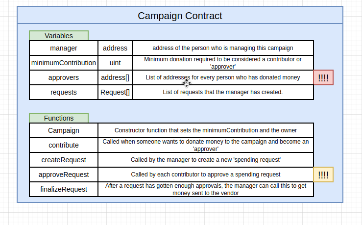

### `kickstart project`

### `vendor`

### `notideal`

### `contract`

### `request`

### `vote`

### `contract-2`

### `struct`

### `storage`

### `storage-2`

### `memory`

### `location`

### `storage-vs-memory`

### `s-v-m`

### `two-sides`

### `votin`

### `voting`

### `array`

### `gas`

### `gas-2`

### `large`

### `work`

### `mapping`

### `more`

### `default`

### `final`

### `approvers-mapping`

### `requests`

### `rinkeby`

### `factory`

### `deployment`

### `deployment-2`

### `we`

### `final`

### `process`

### `factory`

