### `tests`

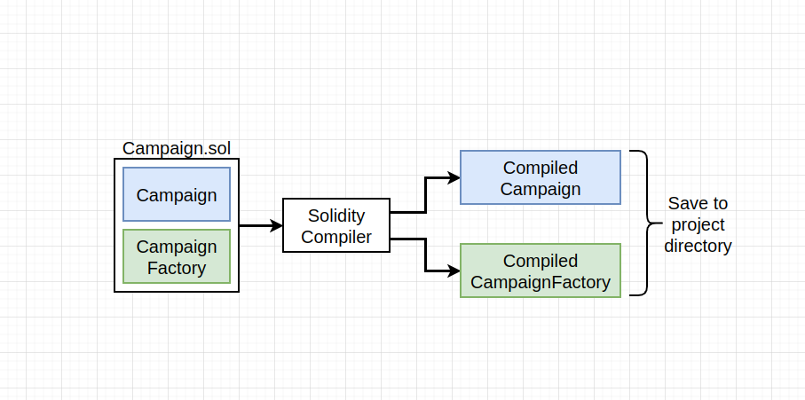

### `compile`

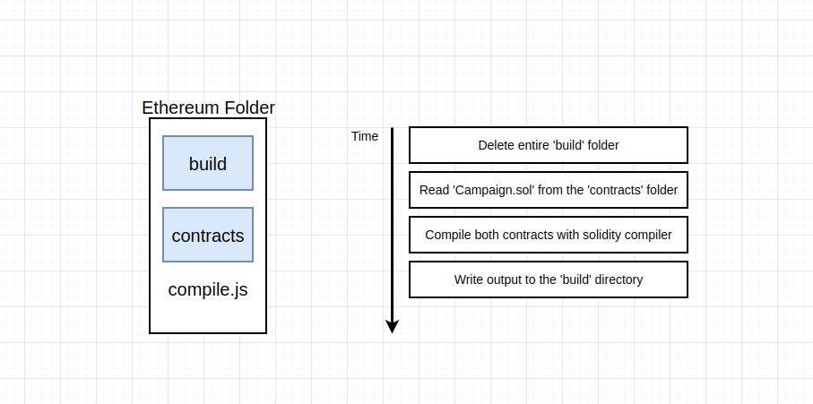

### `mock`

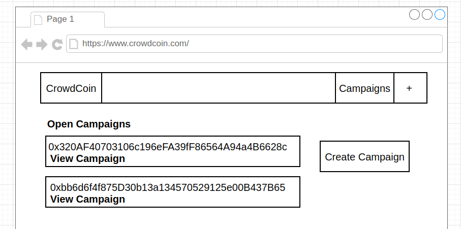

### `create`

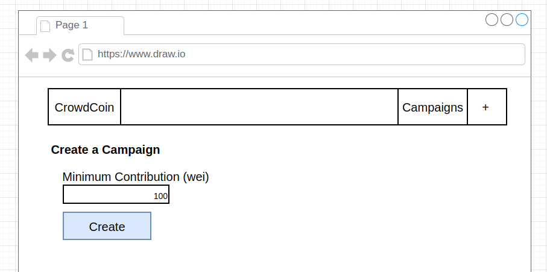

### `detail`

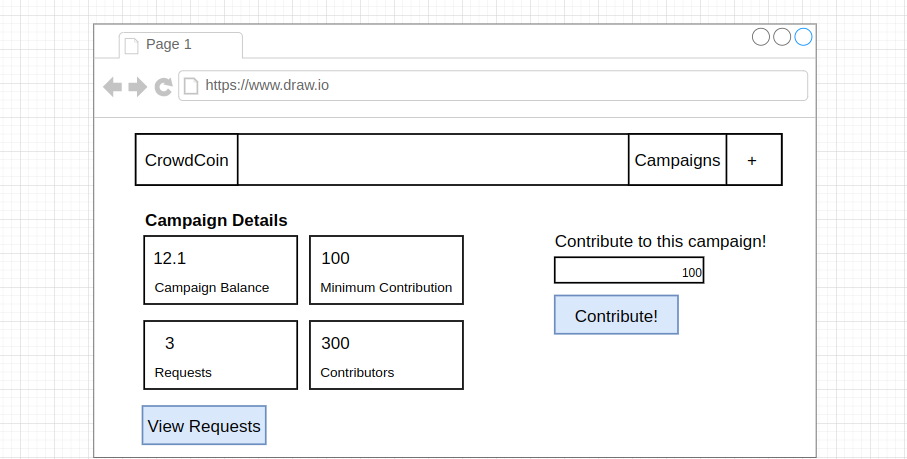

### `reqs`

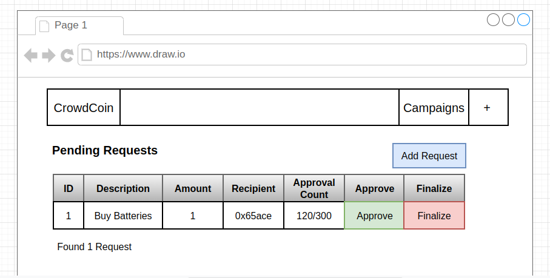

### `create`

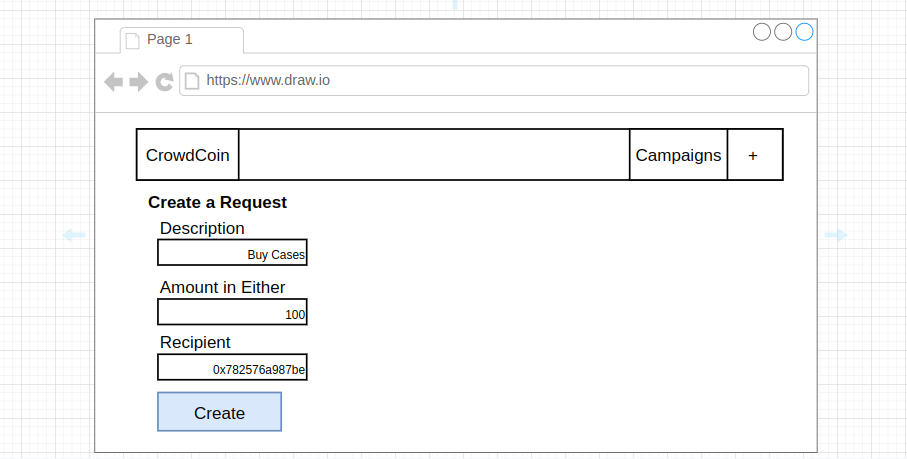

### `routes`

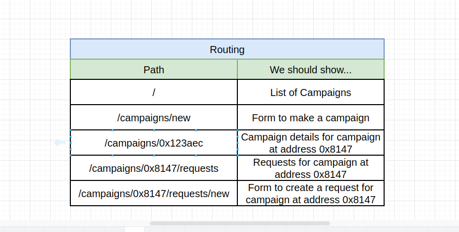

### `cra`

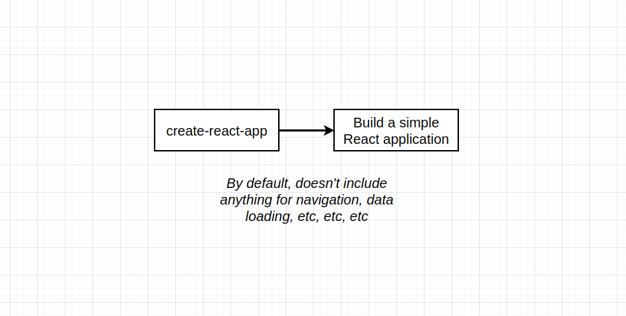

### `next`

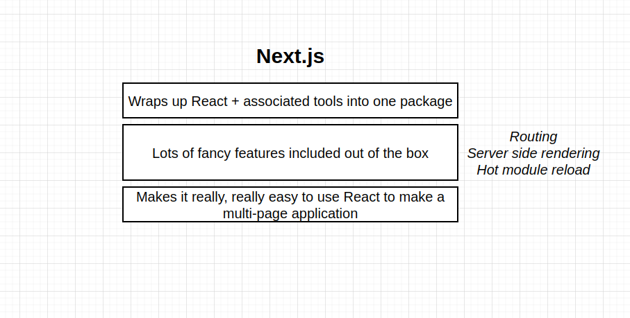

### `next-2`

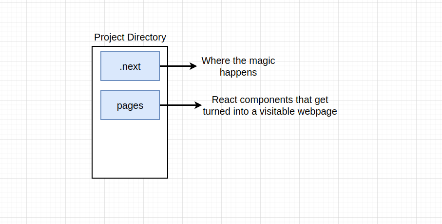

### `routing`

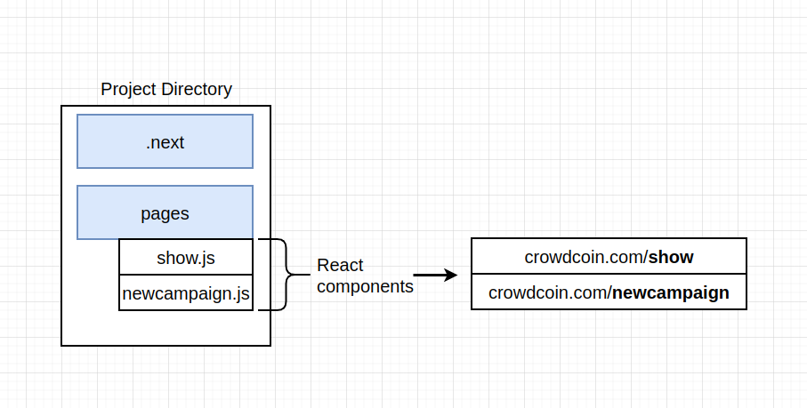

### `files`

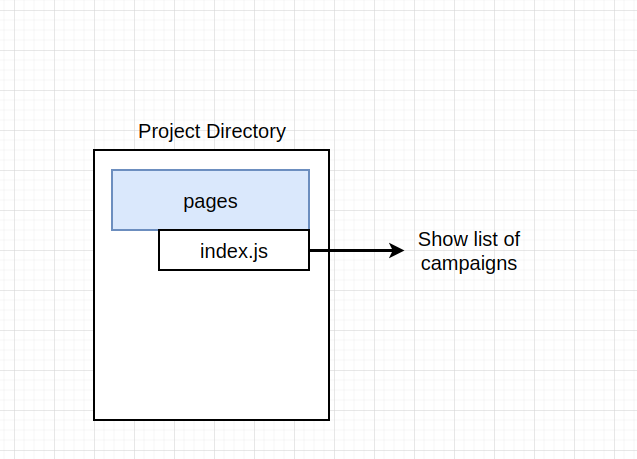

### `todo`

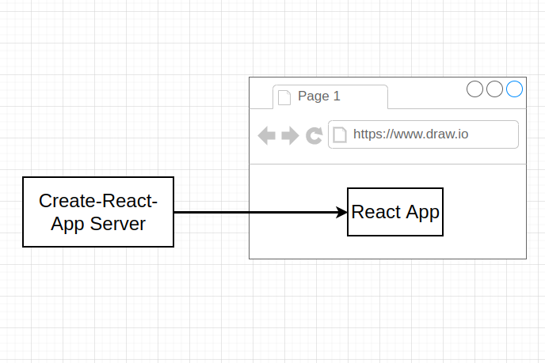

### `cra-2`

### `ssr`

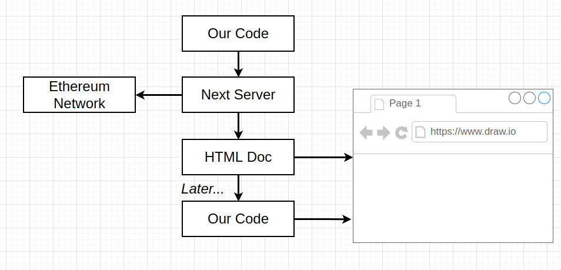

### `ssr-2`

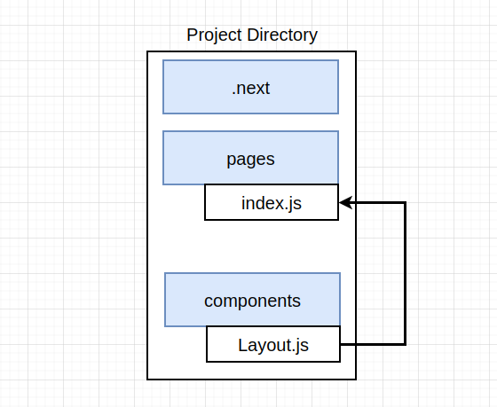

### `layout`

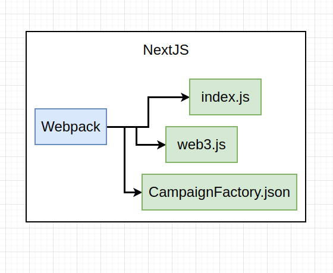

### `webpack`

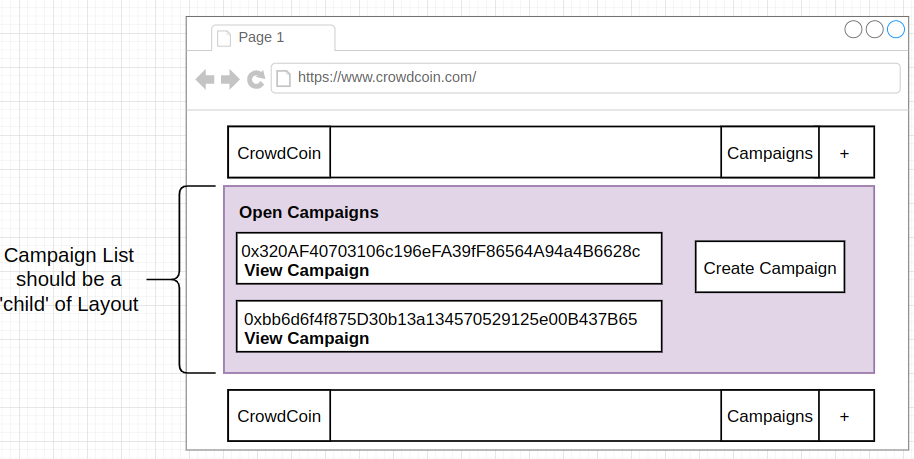

### `children`

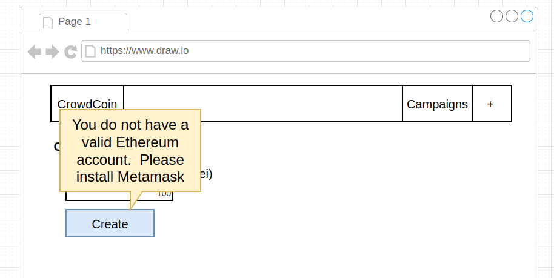

### `popup`

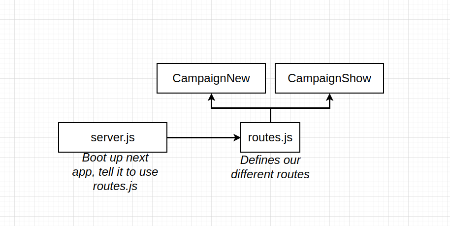

### `index`

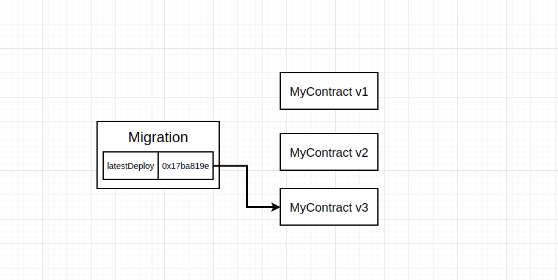

### `migration`

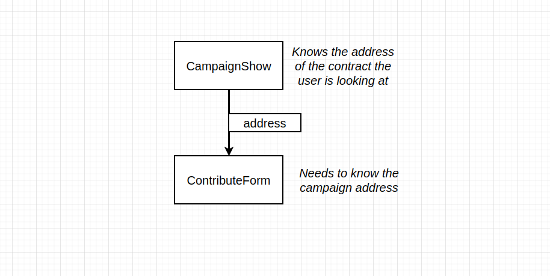

### `campaign`

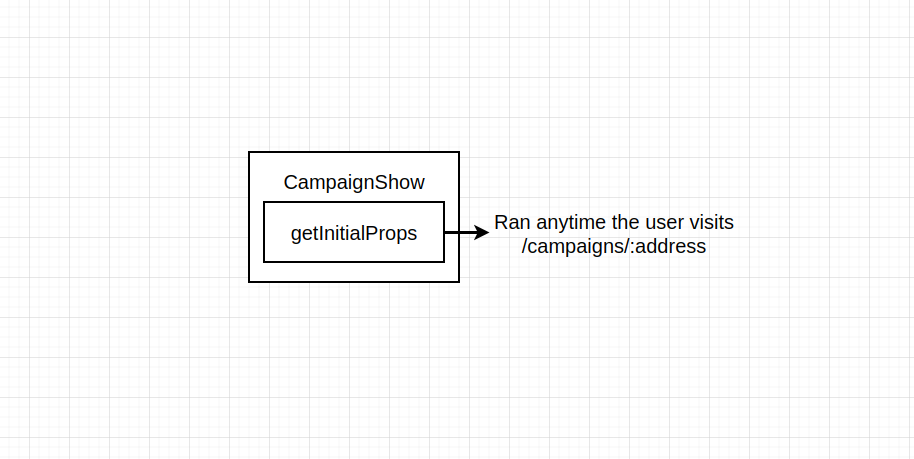

### `refresh`

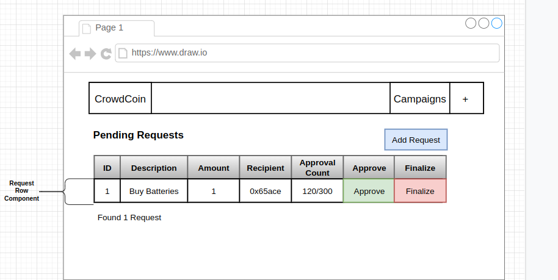
